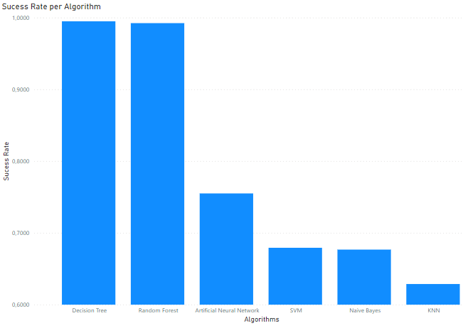

# Heart-Attack-Dataset
Dataset from Kaggle

In this project I have a data set with medical data obtained from a hospital in Iraq, with some patient information. The aim of this project is to be able to predict the outcome (the response) of whether the patient will suffer a heart attack, based on other information. The data set can be found in the "Medicaldataset.csv" file. 

I did an exploratory analysis of the data initially to avoid inconsistent or incorrect data. I then used machine learning algorithms to make this prediction. Each algorithm had a success rate and an error rate. Based on the success rates, I selected the algorithm with the best success rate. You can see the success rates of the algorithms in the image below. This graphic was obtained by Power BI, based on the "results.csv" file.

I came to the conclusion that the best algorithm for this prediction was the Decision Tree algorithm and finally I combined what it predicted with the training set.
